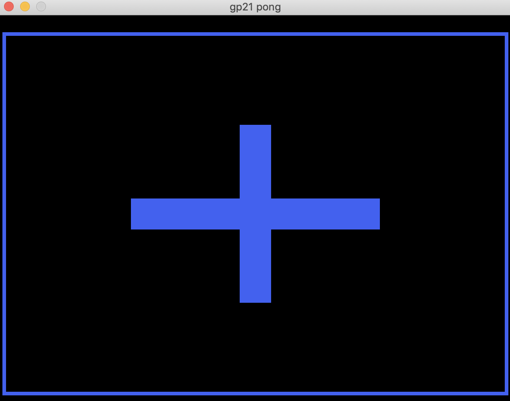
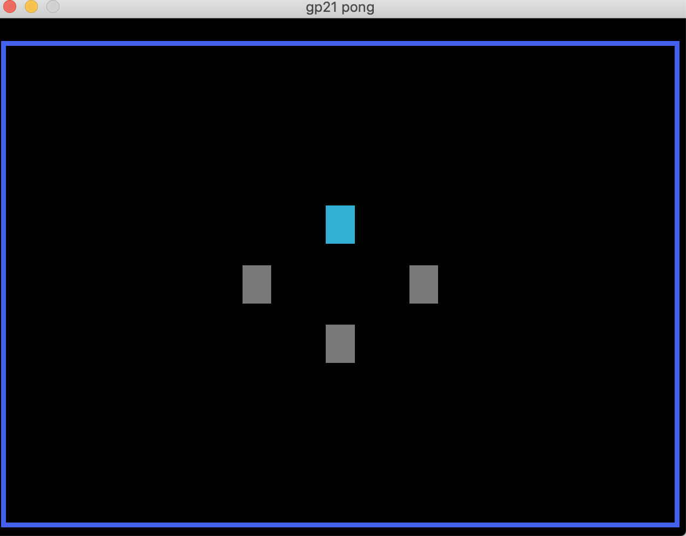

# The Ultimate Memory Challenge

Author: George Whitfield

Design: View a pattern on the screen and repeat it back. The better you do, 
the harder it gets.

Screen Shot:

### How To Play:

Controls: WASD, Arrow Keys

The Ultimate Memory Challenge has 2 phases: DELIVERY and RECALL. 

When the game is first loaded you will see a blue plus sign. To begin, press 
the spacebar.

In the DELIVERY phase, the player is presented with 4 boxes, each corresponding to a different 
direction, i.e. up down left right. The boxes will light up in a sequence. The player must 
memorize the sequence during the DELIVERY phase. 

In the RECALL phase, the player no longer sees the boxes. They must press WASD or the 
arrow keys to correctly recall the sequence that they saw during the DELIVERY phase.

This game was built with [NEST](NEST.md).
